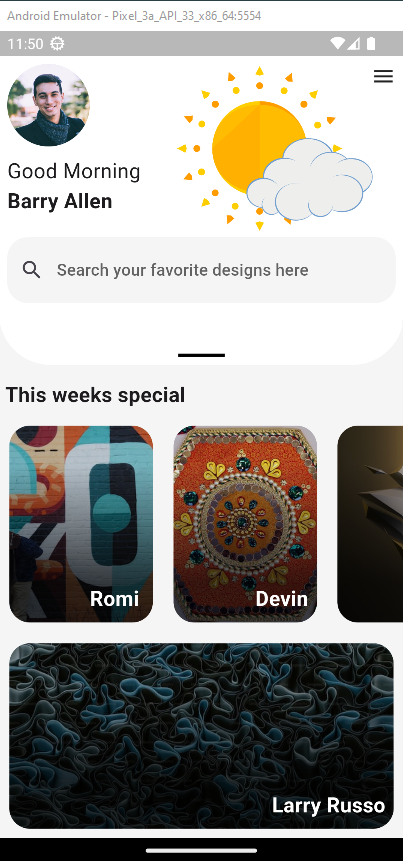
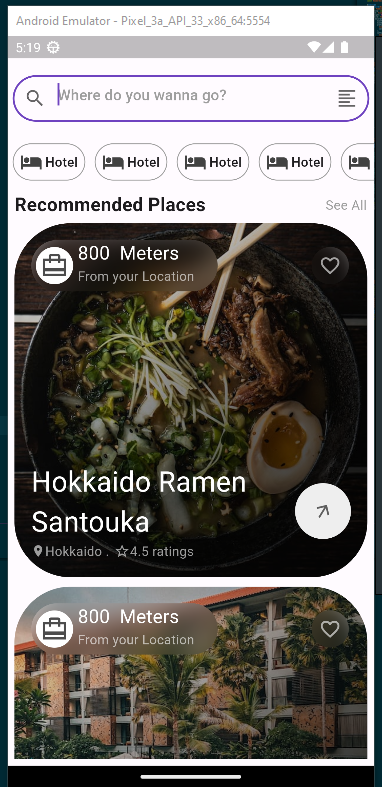
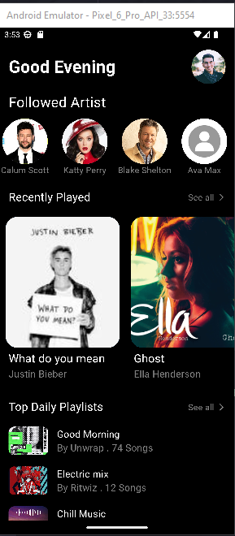

# Basic Flutter UI

This is a collection of basic UI in Flutter.

    

        <h3>1. Design Palette</h3>
        
        
Inspiration - <a href="">Design Pallete</a>

    

    

        <h3>2. Wanderer</h3>
        
        
Inspiration - <a href="https://dribbble.com/shots/21918584-halland-Travel-Mobile-Apps">Halland Travel Mobile Apps</a>

    

    

        <h3>3. Rhythm</h3>
        
        
Inspiration - <a href="https://dribbble.com/shots/19117673-Music-App">Music App</a>

    

   